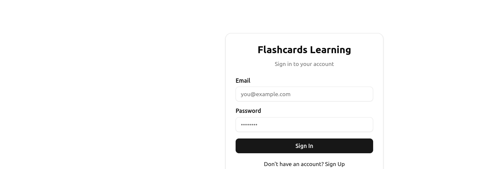
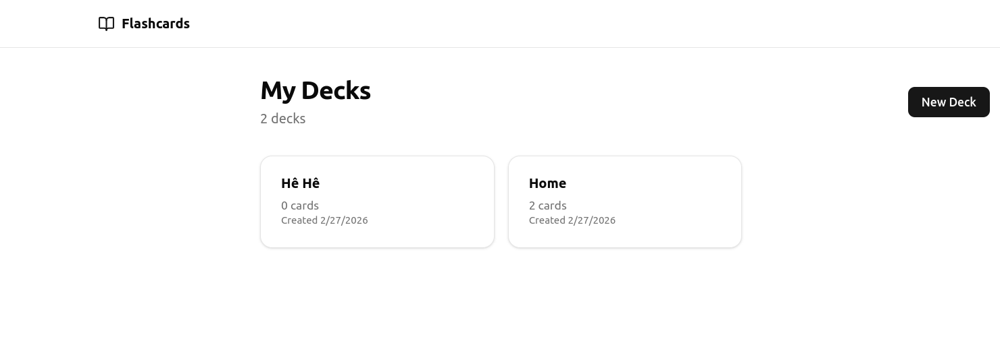
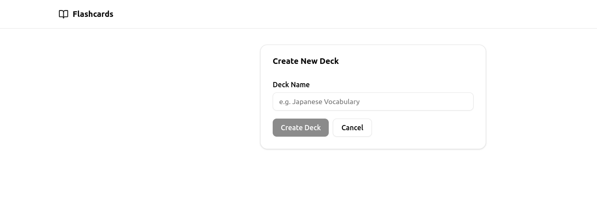
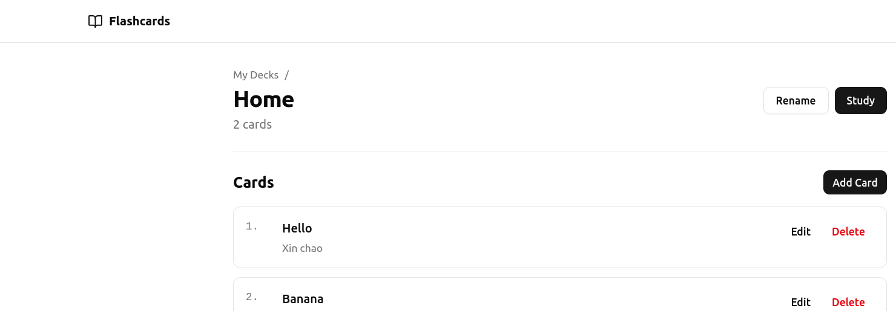
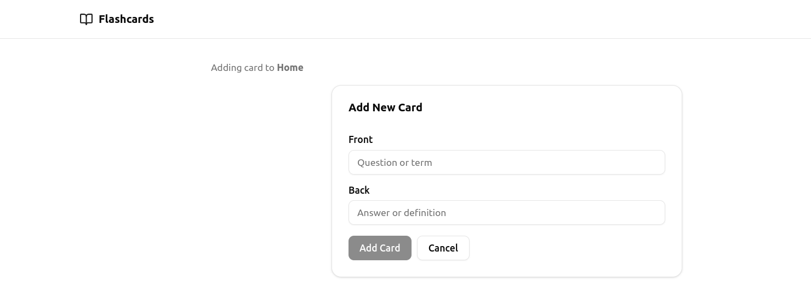
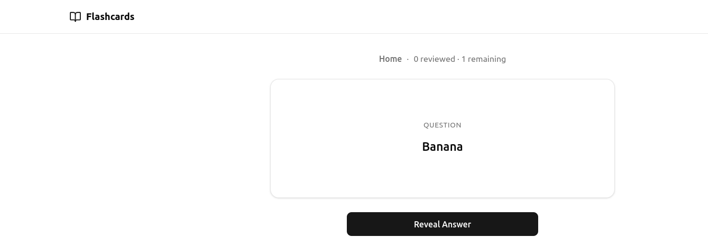
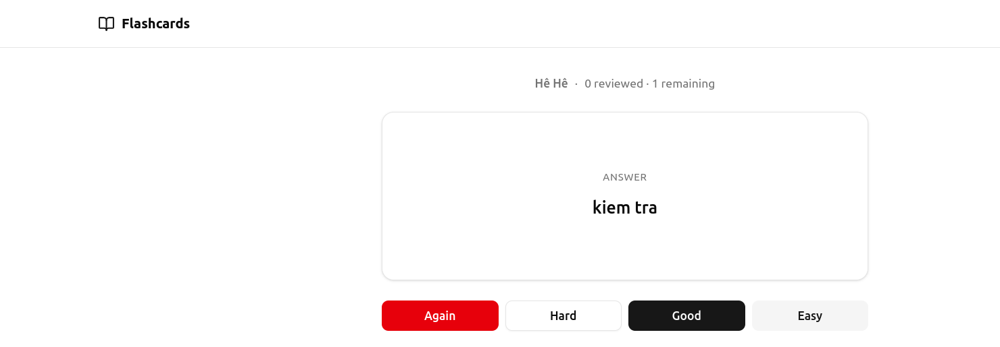
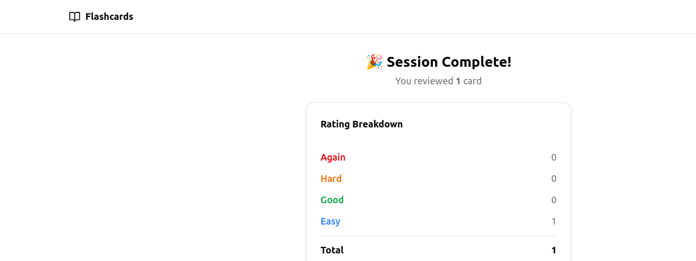
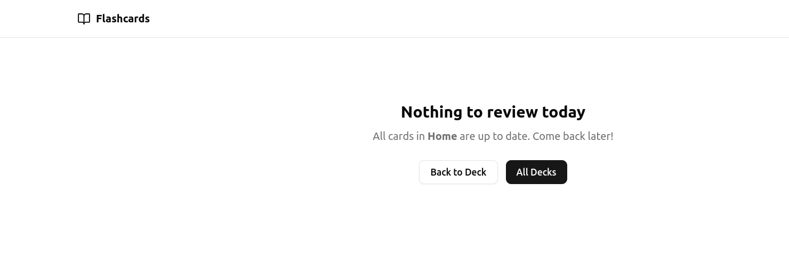
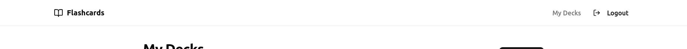

# Flashcards Learning - Product Documentation

## Giới thiệu

**Flashcards Learning** là ứng dụng học flashcard sử dụng thuật toán **SM-2 Spaced Repetition** giúp tối ưu hóa việc ghi nhớ kiến thức. Ứng dụng được xây dựng với công nghệ hiện đại, bảo mật cao, và trải nghiệm người dùng mượt mà.

### Tính năng chính

| Tính năng | Mô tả |
|-----------|-------|
| 📚 **Quản lý Deck** | Tạo, đổi tên, xóa các bộ flashcard |
| 🃏 **Quản lý Card** | Thêm, sửa, xóa các thẻ học với mặt trước/sau |
| 🧠 **Study Session** | Phiên học với hiển thị câu hỏi → đáp án |
| 📈 **Spaced Repetition** | Thuật toán SM-2 tính toán lịch ôn tập tối ưu |
| 🔐 **Authentication** | Đăng nhập/Đăng xuất bảo mật với Supabase Auth |

---

## Screenshots

### 1. Trang đăng nhập


**Mô tả**: Trang đăng nhập cho phép người dùng đăng nhập hoặc đăng ký tài khoản mới.

**Cách chụp**: Truy cập `http://localhost:3000/login`

---

### 2. Danh sách Deck


**Mô tả**: Hiển thị tất cả các bộ flashcard của người dùng với số lượng thẻ trong mỗi deck.

**Cách chụp**: Sau khi đăng nhập, truy cập `http://localhost:3000/decks`

**Thành phần UI**:
- Header với logo và nút Logout
- Nút "New Deck" để tạo deck mới
- Danh sách deck với tên và số lượng card
- Các action: View, Edit, Delete, Study

---

### 3. Tạo Deck mới


**Mô tả**: Form tạo deck mới với trường nhập tên deck.

**Cách chụp**: Click nút "New Deck" hoặc truy cập `http://localhost:3000/decks/new`

---

### 4. Chi tiết Deck & Danh sách Card


**Mô tả**: Xem chi tiết một deck với danh sách các card bên trong.

**Cách chụp**: Click vào một deck từ danh sách

**Thành phần UI**:
- Tên deck và số lượng card
- Nút "Study" để bắt đầu phiên học
- Nút "Add Card" để thêm card mới
- Danh sách card với preview mặt trước

---

### 5. Thêm/Sửa Card


**Mô tả**: Form thêm hoặc chỉnh sửa card với 2 trường: Front (câu hỏi) và Back (đáp án).

**Cách chụp**: Click "Add Card" hoặc edit một card có sẵn

---

### 6. Study Session - Mặt trước (Câu hỏi)


**Mô tả**: Hiển thị mặt trước của card với nút "Reveal Answer".

**Cách chụp**: Click "Study" từ deck detail khi có card due

---

### 7. Study Session - Mặt sau (Đáp án)


**Mô tả**: Sau khi reveal, hiển thị đáp án và 4 nút rating.

**Cách chụp**: Click "Reveal Answer" trong study session

**Rating buttons**:
- 🔴 **Again** - Không nhớ, card sẽ xuất hiện lại trong session
- 🟠 **Hard** - Khó nhớ, interval tăng chậm
- 🟢 **Good** - Nhớ tốt, interval tăng bình thường
- 🔵 **Easy** - Rất dễ nhớ, interval tăng nhanh

---

### 8. Session Summary


**Mô tả**: Màn hình tổng kết sau khi hoàn thành phiên học.

**Cách chụp**: Rate tất cả các card trong session

**Thông tin hiển thị**:
- Tổng số card đã review
- Số lần rating theo từng loại
- Nút quay về deck

---

### 9. Empty State - Không có card due


**Mô tả**: Hiển thị khi deck không có card nào cần ôn tập hôm nay.

**Cách chụp**: Truy cập Study khi tất cả card đều scheduled cho tương lai

---

### 10. Header với Logout


**Mô tả**: Header navigation với logo, link "My Decks", và nút Logout.

**Cách chụp**: Bất kỳ trang authenticated nào

---

## Luồng sử dụng chính

```
┌─────────────┐     ┌─────────────┐     ┌─────────────┐
│   Login     │────▶│  Deck List  │────▶│ Deck Detail │
└─────────────┘     └─────────────┘     └─────────────┘
                           │                   │
                           ▼                   ▼
                    ┌─────────────┐     ┌─────────────┐
                    │ Create Deck │     │  Add Card   │
                    └─────────────┘     └─────────────┘
                                               │
                                               ▼
                                        ┌─────────────┐
                                        │Study Session│
                                        └─────────────┘
                                               │
                                               ▼
                                        ┌─────────────┐
                                        │   Summary   │
                                        └─────────────┘
```

---

## Hướng dẫn chụp Screenshot

### Chuẩn bị

1. Start development server:
   ```bash
   npm run dev
   ```

2. Start Supabase local:
   ```bash
   supabase start
   ```

3. Tạo thư mục screenshots:
   ```bash
   mkdir -p docs/screenshots
   ```

### Công cụ chụp

**macOS**: `Cmd + Shift + 4` → chọn vùng → lưu

**Linux**: 
- GNOME Screenshot: `gnome-screenshot -a`
- Flameshot: `flameshot gui`

**Windows**: `Win + Shift + S`

**Browser DevTools**: F12 → Device toolbar → chọn viewport → screenshot

### Recommended viewport
- **Desktop**: 1280 x 800
- **Mobile**: 375 x 667 (iPhone SE)

### Naming convention
```
docs/screenshots/
├── 01-login.png
├── 02-deck-list.png
├── 03-create-deck.png
├── 04-deck-detail.png
├── 05-card-form.png
├── 06-study-front.png
├── 07-study-back.png
├── 08-session-summary.png
├── 09-no-cards-due.png
└── 10-header-logout.png
```

---

## Tech Stack

| Layer | Technology |
|-------|------------|
| **Framework** | Next.js 16 (App Router) |
| **Language** | TypeScript (strict mode) |
| **Database** | Supabase PostgreSQL |
| **Auth** | Supabase Auth |
| **Styling** | Tailwind CSS + shadcn/ui |
| **Validation** | Zod |
| **Testing** | Vitest |
| **Algorithm** | SM-2 Spaced Repetition |

---

## API Endpoints

| Method | Endpoint | Description |
|--------|----------|-------------|
| GET | `/api/decks` | List all decks |
| POST | `/api/decks` | Create new deck |
| PATCH | `/api/decks/[id]` | Rename deck |
| DELETE | `/api/decks/[id]` | Delete deck |
| GET | `/api/decks/[id]/cards` | List cards in deck |
| POST | `/api/decks/[id]/cards` | Add card to deck |
| GET | `/api/decks/[id]/study` | Get due cards for study |
| PATCH | `/api/cards/[id]` | Edit card |
| DELETE | `/api/cards/[id]` | Delete card |
| POST | `/api/cards/[id]/review` | Submit card rating |
| POST | `/api/auth/logout` | Logout user |

---

## SM-2 Algorithm

### Rating System

| Rating | Name | Effect |
|--------|------|--------|
| 1 | **Again** | Reset interval to 1, decrease ease factor |
| 2 | **Hard** | Interval × 1.2, decrease ease factor |
| 3 | **Good** | Interval × ease factor |
| 4 | **Easy** | Interval × ease factor × 1.3, increase ease factor |

### Scheduling Formula

```
Initial state:
  ease_factor = 2.5
  interval = 0
  repetitions = 0
  next_review_date = today

After rating:
  next_review_date = today + interval_days
```

### Ease Factor

- Minimum: 1.3 (floor)
- Default: 2.5
- Adjusted based on ratings

---

## Security Features

### Row Level Security (RLS)
- Mỗi user chỉ có thể xem/sửa data của mình
- Enforced at database level

### Middleware Protection
- Protected routes require authentication
- API routes return 401 for unauthenticated requests
- Cache-Control headers prevent back-button access after logout

### Session Management
- Server-side session validation
- Complete session clearing on logout
- Cookie management with Supabase SSR

---

## Development Setup

### Prerequisites
- Node.js 20+
- Supabase CLI

### Quick Start

```bash
# Clone repository
git clone <repo-url>
cd flashcards-learning

# Install dependencies
npm install

# Start Supabase
supabase start

# Copy environment variables
cp .env.local.example .env.local

# Start dev server
npm run dev
```

### Available Scripts

| Script | Description |
|--------|-------------|
| `npm run dev` | Start development server |
| `npm run build` | Build for production |
| `npm run lint` | Run ESLint |
| `npm run type-check` | TypeScript check |
| `npm test` | Run unit tests |

---

## License

MIT License
